# Cognitive Prompt Architecture (CPA)

## Definition

**Cognitive Prompt Architecture (CPA)** is a structured methodology designed to enhance large language model (LLM) performance by applying domain-specific cognitive strategies through prompts, without requiring model retraining. CPA comprises six distinct *domains of thought*—[Reasoning Cycle](#reasoning-cycle-explore-rc) (RC: Explore), [Adversarial Refinement](#adversarial-refinement-challenge-ar) (AR: Challenge), [Evolutionary Growth](#evolutionary-growth-evolve-eg) (EG: Evolve), [Dialectic Inquiry](#dialectic-inquiry-question-di) (DI: Question), [Panel Synthesis](#panel-synthesis-integrate-ps) (PS: Integrate), and [Constraint Dynamics](#constraint-dynamics-adapt-cd) (CD: Adapt)—each tailored to guide LLMs in solving complex tasks systematically. These domains are supported by a memory integration system that employs a three-layered memory bank[^1] to maintain context and facilitate continuous improvement through structured self-evaluation.

Each domain follows a standardized five-phase process—Problem Exploration & Solution Space Mapping, Detailed Analysis, Implementation & Verification, Self-Evaluation & Reward Calculation, and Knowledge Integration—to ensure rigorous problem-solving and measurable outcomes. CPA adapts established computational paradigms, including [Monte Carlo Tree Search](#background-paradigms-and-algorithms) (MCTS), [Markov Decision Processes](#background-paradigms-and-algorithms) (MDPs), and [temporal difference learning](#background-paradigms-and-algorithms) (TD Learning), into a prompt-driven framework for LLMs.

## Executive Summary

The Cognitive Prompt Architecture (CPA) is a powerful framework designed to enhance the problem-solving capabilities of Large Language Models (LLMs) without requiring retraining. By structuring prompts around six distinct cognitive domains, CPA guides LLMs through systematic thinking processes that mirror human expert reasoning.

Key benefits of CPA include:

- **Enhanced Problem Exploration**: Systematically maps solution spaces and evaluates alternatives
- **Improved Solution Quality**: Applies critical thinking and adversarial analysis to identify weaknesses
- **Balanced Decision-Making**: Integrates multiple perspectives to create holistic solutions
- **Adaptive Problem-Solving**: Navigates constraints effectively through progressive refinement
- **Measurable Outcomes**: Includes built-in evaluation metrics for continuous improvement

CPA is particularly valuable for complex tasks requiring deep reasoning, such as software architecture design, strategic planning, and multi-faceted problem-solving. The framework's structured approach helps LLMs deliver more reliable, well-reasoned, and comprehensive solutions across diverse domains.

For machine learning applications, consider reviewing our [Foundation Questions](machine-learning/foundation-questions.md) guide to establish a clear understanding before applying CPA to your ML projects.

## Abstract

Cognitive Prompt Architecture (CPA) is a methodology that utilizes six cognitive domains—Reasoning Cycle, Adversarial Refinement, Evolutionary Growth, Dialectic Inquiry, Panel Synthesis, and Constraint Dynamics—to systematically improve LLM task performance without retraining. Supported by a structured memory bank system, CPA enables LLMs to explore solution spaces, evaluate approaches, implement solutions, and refine strategies through prompt-guided cognitive processes. CPA aims to achieve high-fidelity outcomes by integrating principles from reinforcement learning—such as Monte Carlo Tree Search, Markov Decision Processes, and temporal difference learning—into a scalable, prompt-based approach, advancing LLM reasoning and problem-solving capabilities.

## Table of Contents

- [Executive Summary](#executive-summary)
- [Background Paradigms and Algorithms](#background-paradigms-and-algorithms)
- [Evaluation Approach](#evaluation-approach)
- [CPA Domains](#cpa-domains)
  - [Reasoning Cycle: Explore (RC)](#reasoning-cycle-explore-rc)
  - [Adversarial Refinement: Challenge (AR)](#adversarial-refinement-challenge-ar)
  - [Evolutionary Growth: Evolve (EG)](#evolutionary-growth-evolve-eg)
  - [Dialectic Inquiry: Question (DI)](#dialectic-inquiry-question-di)
  - [Panel Synthesis: Integrate (PS)](#panel-synthesis-integrate-ps)
  - [Constraint Dynamics: Adapt (CD)](#constraint-dynamics-adapt-cd)
- [Implementation Guidance](#implementation-guidance)
- [References](#references)
- [Related Resources](#related-resources)
  - [Foundation Questions for Machine Learning](machine-learning/foundation-questions.md)

## Background Paradigms and Algorithms

CPA incorporates the following computational paradigms and algorithms, adapted from reinforcement learning and decision theory, as foundational influences:

1.  **Monte Carlo Tree Search (MCTS)**:
    -   *Definition*: A heuristic search algorithm that constructs a tree of possible actions and outcomes, using random sampling to evaluate decisions by balancing exploration and exploitation.
    -   *Role in CPA*: Provides a basis for iterative exploration and evaluation in domains like Reasoning Cycle and Evolutionary Growth.
    -   *Source*: See References [^2].

2.  **Markov Decision Processes (MDPs)**:
    -   *Definition*: A framework modeling decision-making as a sequence of states, actions, and rewards, where the next state depends only on the current state and action.
    -   *Role in CPA*: Underpins state-transition-based refinement in domains like Adversarial Refinement and Panel Synthesis.
    -   *Source*: See References [^3].

3.  **Temporal Difference Learning (TD Learning)**:
    -   *Definition*: A reinforcement learning method that updates value estimates incrementally based on the difference between predicted and actual rewards over time.
    -   *Role in CPA*: Drives heuristic refinement and learning integration in domains like Dialectic Inquiry and Constraint Dynamics.
    -   *Source*: See References [^4].

These paradigms are adapted into CPA’s prompt-driven structure, enabling LLMs to emulate RL-style reasoning.
***
## Evaluation Approach

**CPA utilizes two levels of evaluation**:
#### Cognitive Assessment
*   **Internal Domain Assessment:** Each domain's prompt template includes a self-evaluation section where 4 criteria (e.g., Accuracy, Efficiency, Process, Innovation) are scored from 1-10, totaling 40 points. This guides the structured thinking process *within* that domain.
#### Task Assessment
*   **Boundary Adherence Assessment:** The final output generated through the CPA process can be assessed against a rigorous standard that measures the quality, correctness, and efficiency of the completed work product based on rigidly defined criteria.

This separation allows for both process guidance within domains and quality assessment of the final outcome.

### Internal Domain Assessment Legend

- **Setting A Standard of Excellence:** ≥ 96% (≥ 38 / 40 points)
  *Represents near-perfect, exemplary performance expected from a top-tier foundational model.*

- **Great Performance – Approaching Excellence:** ≥ 94% (≥ 37.6 / 40 points)
  *Indicates very high-quality output, close to the excellence threshold.*

- **Good Job – Strive for Excellence:** ≥ 90% (≥ 36 / 40 points)
  *Meets the strict minimum standard; improvement is encouraged to reach excellence.*

- **Unacceptable for Foundation Model:** < 90% (< 36 / 40 points)
  *Fails to meet baseline quality; requires immediate remediation.*
***
## CPA Domains

Below, each domain is defined with a general description and a *template* for end users to apply, following the five-phase process. The templates are abstract, designed for readers to fill out with their own tasks.

### Domain Relationships Diagram

```mermaid
flowchart TD
    A[Problem Space] --> B[Reasoning Cycle: Explore]
    B --> C[Adversarial Refinement: Challenge]
    B --> D[Evolutionary Growth: Evolve]
    B --> E[Dialectic Inquiry: Question]
    C --> F[Panel Synthesis: Integrate]
    D --> F
    E --> F
    C --> G[Constraint Dynamics: Adapt]
    D --> G
    E --> G
    F --> H[Optimal Solution]
    G --> H

    style A fill:#000000,stroke:#01579b,stroke-width:2px
    style H fill:#000000,stroke:#2e7d32,stroke-width:2px
```



This diagram illustrates how the six domains of CPA work together to transform a problem into an optimal solution. The process typically begins with Reasoning Cycle to explore the solution space, followed by specialized domains that refine, evolve, and question the approach. Finally, Panel Synthesis and Constraint Dynamics help integrate perspectives and adapt to constraints before arriving at the optimal solution.

***

### Reasoning Cycle: Explore (RC)

**Description**: This domain applies a systematic, multi-phase process inspired by **Monte Carlo Tree Search (MCTS)** principles. It guides the LLM through **explicit exploration** of potential solutions, **detailed analysis** of promising candidates (including complexity, efficiency, and failure modes), rigorous **implementation and verification**, and structured **self-evaluation** to ensure optimal outcomes. It emphasizes a methodical progression from problem understanding to a validated solution.

#### Prompt Template
```markdown
**Phase 1: Problem Exploration & Solution Space Mapping**
- **PROBLEM STATEMENT**: [Define the task requiring a systematic solution.]
- **EXPLORATION**:
  - **Approach A**: [Describe a possible solution approach.]
    - Complexity: [Score 1-10]
    - Efficiency: [Score 1-10]
    - Failure Modes: [List potential issues]
  - **Approach B**: [Describe another solution approach.]
    - Complexity: [Score 1-10]
    - Efficiency: [Score 1-10]
    - Failure Modes: [List potential issues]
  - **Approach C**: [Describe a third solution approach.]
    - Complexity: [Score 1-10]
    - Efficiency: [Score 1-10]
    - Failure Modes: [List potential issues]

**Phase 2: Detailed Analysis**
- **Selected Approach**: [Choose one with justification based on exploration.]
- **Analysis Details**:
  - Implementation Steps: [Break down into actionable steps.]
  - Edge Cases: [Identify and propose handling strategies.]
  - Expected Performance: [Estimate time complexity O(?), space complexity O(?), maintainability (1-10), extensibility (1-10).]
  - Optimizations: [List potential improvements.]

**Phase 3: Implementation & Verification**
- **IMPLEMENTATION**: [Detail the executed solution process or pseudocode.]
- **VERIFICATION**: [Describe how the solution was validated against requirements/tests.]

**Phase 4: Self-Evaluation & Reward Calculation**
- **SELF-EVALUATION**: [Score each criterion 1-10]
  - Accuracy: [Score 1-10] - [Justify based on requirements met.]
  - Efficiency: [Score 1-10] - [Justify based on performance.]
  - Process: [Score 1-10] - [Justify based on thoroughness.]
  - Innovation: [Score 1-10] - [Justify based on creativity.]
  - Total Score: [Sum/40]

**Phase 5: Knowledge Integration**
- **LEARNING INTEGRATION**:
  - What Worked: [Highlight successful elements.]
  - What Didn’t: [Note failures or inefficiencies.]
  - Future Improvements: [Propose strategies for next iterations.]
```
#### RC: Explore - Internal Domain Assessment Criteria
```markdown
**Rewards**:
+10: Explores a wide, diverse solution space with clear mapping.
+5: Selects the most promising approach based on quantitative analysis.
+3: Provides detailed, accurate complexity and performance estimates.
+2: Identifies and plans for edge cases comprehensively.
+2: Proposes optimizations beyond initial solutions.
+1: Documents clear rationale for approach selection.
**Penalties**:
-10: Fails to explore multiple approaches or ignores alternatives.
-5: Selects an approach without justification or flawed reasoning.
-5: Provides inaccurate or missing complexity/performance estimates.
-3: Misses obvious edge cases.
-2: Lacks optimization considerations.
-1: Provides vague or unsupported rationale.
```
#### Key Benefits of This Approach

This domain effectively simulates Monte Carlo Tree Search (MCTS) concepts by:
1.  Mapping the solution space through the generation and initial assessment of multiple candidate approaches (**Exploration Phase**, akin to MCTS node expansion).
2.  Performing in-depth, forward-looking evaluation of selected approaches, analyzing steps, edge cases, and expected performance (**Detailed Analysis Phase**, similar to MCTS simulation/evaluation).
3.  Guiding the implementation and verification against defined criteria (**Implementation & Verification Phase**).
4.  Utilizing a quantitative 0-100 scoring rubric within the prompt (**Self-Evaluation Phase**) to assess the *process and intermediate solution quality*, providing clear signals for refinement.
5.  Integrating learnings from the evaluation into future iterations or tasks (**Knowledge Integration Phase**, mirroring MCTS tree updates or policy improvement).

The primary advantage is guiding the LLM towards well-reasoned and validated solutions via a structured, prompt-driven workflow, without requiring model retraining.

#### Target Topics
- Algorithm design and optimization (e.g., sorting, search algorithms).
- System configuration and architecture planning.
- Complex workflow automation and process design.
- Problems requiring systematic comparison of alternatives.

#### Example Application
```markdown
**Phase 1: Problem Exploration & Solution Space Mapping**
- **PROBLEM STATEMENT**: Design an efficient data processing pipeline for real-time analytics.
- **EXPLORATION**:
  - **Approach A**: Batch processing with scheduled jobs
    - Complexity: 6/10
    - Efficiency: 5/10
    - Failure Modes: High latency, potential data loss during failures
  - **Approach B**: Stream processing with Apache Kafka
    - Complexity: 8/10
    - Efficiency: 9/10
    - Failure Modes: Complex error handling, requires careful scaling
  - **Approach C**: Hybrid approach with both batch and streaming
    - Complexity: 9/10
    - Efficiency: 8/10
    - Failure Modes: Increased operational complexity, synchronization issues

**Phase 2: Detailed Analysis**
- **Selected Approach**: B - Stream processing with Apache Kafka
- **Analysis Details**:
  - Implementation Steps: Set up Kafka cluster, design topics, implement producers/consumers...
  - Edge Cases: Network partitions, message ordering guarantees, backpressure handling
  - Expected Performance: O(1) per message, horizontal scalability, 99.9% uptime
  - Optimizations: Compression, partitioning strategy, consumer group design
```

***

### Adversarial Refinement: Challenge (AR)

**Description**: This domain enhances solution robustness by employing a process inspired by **[Markov Decision Process](https://en.wikipedia.org/wiki/Markov_decision_process) (MDP)** state transitions, it guides the LLM to generate a solution, rigorously critique it from an opposing viewpoint to identify weaknesses or edge cases, and then refine the solution based on that critique. It focuses on iterative improvement through structured critical analysis.

#### Prompt Template
```markdown
**PROBLEM STATEMENT**: [Define the task requiring critical refinement.]

**Phase 1: Initial Solution Generation (Creator Phase)**
- **Initial Approach**: [Describe the first proposed solution.]
  - Assumptions: [List underlying assumptions.]
  - Perceived Strengths: [Highlight expected benefits.]
- **Implementation Draft**: [Provide initial implementation or detailed pseudocode.]

**Phase 2: Critical Analysis (Critic Phase)**
- **Critique**: [Rigorously analyze the initial solution.]
  - Weaknesses: [Identify potential flaws, bottlenecks, or limitations.]
  - Edge Cases Missed: [List scenarios not handled.]
  - Assumptions Challenged: [Question the validity of initial assumptions.]

**Phase 3: Solution Refinement (Defender Phase)**
- **Addressing Critiques**: [Detail how each point from the Critic Phase is addressed.]
  - Modifications: [Describe specific changes made to the solution.]
  - Trade-offs: [Document any compromises made during refinement.]
- **Refined Implementation**: [Provide the updated implementation or pseudocode.]

**Phase 4: Evaluation (Judge Phase)**
- **Comparison**: [Evaluate the original vs. refined solution.]
- **Improvement Assessment**: [Quantify improvements using relevant metrics.]
- **Further Iteration Needed?**: [Yes/No, with justification.]
- **SELF-EVALUATION**: [Score each criterion 1-10]
  - Accuracy: [Score 1-10] - [Justify based on requirements met by refined solution.]
  - Efficiency: [Score 1-10] - [Justify based on performance improvements.]
  - Process: [Score 1-10] - [Justify based on depth of critique and defense.]
  - Innovation: [Score 1-10] - [Justify based on creativity in addressing flaws.]
  - Total Score: [Sum/40]

**Phase 5: Knowledge Integration**
- **LEARNING INTEGRATION**:
  - Key Insights: [What was learned from the critique process?]
  - Patterns Identified: [Note recurring weaknesses or successful refinement strategies.]
  - Future Improvements: [Propose strategies for better refinement next time.]
```
#### AR: Challenge - Internal Domain Assessment Criteria
```markdown
**Rewards**:
- +10: Identifies critical flaws and vulnerabilities in initial solution.
- +5: Provides rigorous, constructive critique with actionable insights.
- +3: Refines solution to address all major weaknesses.
- +2: Balances improvements without overcomplicating.
- +2: Documents trade-offs transparently.
- +1: Demonstrates iterative improvement over initial version.

**Penalties**:
- -10: Misses major flaws or security issues.
- -5: Provides superficial or unconstructive critique.
- -5: Fails to address identified weaknesses in refinement.
- -3: Introduces new issues during refinement.
- -2: Obscures or ignores trade-offs.
- -1: Minimal or no improvement over initial solution.
```
#### Key Benefits of This Approach

This domain effectively simulates adversarial thinking and refinement concepts by:
1.  Generating an initial solution (**Creator Phase**).
2.  Systematically identifying potential flaws, bottlenecks, or unmet requirements through structured self-critique (**Critic Phase**, akin to evaluating state transitions in MDPs).
3.  Addressing identified weaknesses through targeted revisions (**Defender Phase**).
4.  Evaluating the improvement and determining if further refinement is needed (**Judge Phase**).
5.  Utilizing a 0-100 scoring rubric within the prompt to quantify the effectiveness of the refinement process.

The primary advantage is fostering more robust and resilient solutions by forcing the LLM to anticipate and address potential issues through a structured, internal critique loop, all driven by prompts.

#### Target Topics
- Code review and debugging (e.g., identifying software flaws).
- Security analysis and vulnerability assessment.
- Requirement validation and specification refinement.
- Risk assessment and mitigation planning.

#### Example Application
```markdown
**PROBLEM STATEMENT**: Secure a web application's authentication system.

**Phase 1: Initial Solution Generation (Creator Phase)**
- **Initial Approach**: Implement JWT-based authentication with refresh tokens.
  - Assumptions: JWTs are secure if properly implemented; refresh tokens improve UX.
  - Perceived Strengths: Stateless authentication, reduced database load, standard approach.

**Phase 2: Critical Analysis (Critic Phase)**
- **Critique**:
  - Weaknesses: JWT cannot be invalidated before expiration; token theft remains possible.
  - Edge Cases Missed: Account takeover during active sessions, token leakage in logs.
  - Assumptions Challenged: JWT implementation complexity often leads to security flaws.

**Phase 3: Solution Refinement (Defender Phase)**
- **Addressing Critiques**:
  - Modifications: Add server-side token registry for revocation; implement short expiration times.
  - Trade-offs: Slightly increased server load, but significantly improved security posture.
```

***

### Evolutionary Growth: Evolve (EG)

**Description**: This domain fosters solution development through iterative refinement and incremental enhancement, inspired by **[Evolutionary Algorithms](https://en.wikipedia.org/wiki/Evolutionary_algorithm)**. It guides the LLM to generate initial solution variants, evaluate their fitness, combine successful elements, and introduce targeted improvements over successive cycles, emphasizing gradual progress and adaptation.

#### Prompt Template
```markdown

**PROBLEM STATEMENT**: [Define the task requiring iterative development.]

**Phase 1: Population Generation**
- **Initial Variants**: [Generate diverse initial solutions (e.g., 3-4 approaches).]
  - **Variant A**: [Description, Key Features]
  - **Variant B**: [Description, Key Features]
  - **Variant C**: [Description, Key Features]
- **Initial Fitness**: [Briefly evaluate each variant against key metrics.]

**Phase 2: Selection & Recombination**
- **Selection**: [Identify top-performing elements/ideas from the initial variants.]
- **Recombination**: [Create 1-2 hybrid approaches combining the selected strengths.]
  - **Hybrid 1**: [Description, Combined Features]
  - **Hybrid 2**: [Description, Combined Features]

**Phase 3: Mutation & Innovation**
- **Targeted Modifications**: [Introduce specific improvements or novel ideas to the hybrid(s).]
  - Modification for Hybrid 1: [Describe change and expected benefit.]
  - Modification for Hybrid 2: [Describe change and expected benefit.]
- **Updated Variants**: [Present the refined hybrid solutions.]

**Phase 4: Evaluation & Convergence Check**
- **Fitness Re-evaluation**: [Assess the updated variants against metrics.]
- **Convergence Analysis**: [Are solutions improving? Is diversity maintained? Is further iteration needed?]
- **SELF-EVALUATION**: [Score each criterion 1-10]
  - Accuracy: [Score 1-10] - [Justify based on final variant's requirement fit.]
  - Efficiency: [Score 1-10] - [Justify based on final variant's performance.]
  - Process: [Score 1-10] - [Justify based on diversity exploration and refinement rigor.]
  - Innovation: [Score 1-10] - [Justify based on creativity of recombination/mutation.]
  - Total Score: [Sum/40]

**Phase 5: Knowledge Integration (Final Selection)**
- **Final Selection**: [Choose the best-performing solution after iterations.]
- **LEARNING INTEGRATION**:
  - Evolutionary Path: [Summarize key breakthroughs during the process.]
  - What Worked: [Highlight successful combinations or mutations.]
  - Future Improvements: [Propose strategies for the next evolutionary cycle if needed.]
```
#### EG: Evolve - Internal Domain Assessment Criteria
```markdown
**Rewards**:
+10: Generates diverse, innovative initial variants.
+5: Effectively combines strengths from multiple variants.
+3: Introduces creative mutations that improve solutions.
+2: Maintains diversity while converging on optimal designs.
+2: Clearly documents evolutionary path and breakthroughs.
+1: Selects final solution with strong justification.
**Penalties**:
-10: Generates redundant or low-quality variants.
-5: Fails to combine or improve upon initial ideas.
-5: Mutations degrade solution quality.
-3: Premature convergence on suboptimal design.
-2: Lacks documentation of evolution process.
-1: Final selection lacks clear rationale.
```
#### Key Benefits of This Approach

This domain effectively simulates evolutionary concepts by:
1.  Generating diverse initial solutions (**Population Generation**).
2.  Evaluating approaches based on defined metrics to identify promising elements (**Fitness Evaluation**).
3.  Combining strengths from different approaches to create improved hybrids (**Selection & Recombination**).
4.  Introducing targeted modifications or creative variations to enhance solutions (**Mutation & Innovation**).
5.  Using the 0-100 scoring rubric within the prompt to track progress and guide the evolutionary process.

The primary advantage is encouraging exploration of diverse solution pathways and preventing premature convergence on suboptimal designs through an iterative, prompt-driven enhancement cycle.

#### Target Topics
- User interface development and refinement.
- Feature prototyping and iterative enhancement.
- Algorithm tuning and multi-parameter optimization.
- Incremental system upgrades and refactoring.

#### Example Application
```markdown
**PROBLEM STATEMENT**: Design a mobile app navigation system that maximizes usability.

**Phase 1: Population Generation**
- **Initial Variants**:
  - **Variant A**: Traditional hamburger menu with nested navigation
  - **Variant B**: Tab-based navigation with 5 main sections
  - **Variant C**: Gesture-based navigation with minimal UI elements
- **Initial Fitness**: Variant B scores highest on immediate usability; C on screen space efficiency.

**Phase 2: Selection & Recombination**
- **Selection**: Tab-based main navigation from B; gesture shortcuts from C.
- **Recombination**:
  - **Hybrid 1**: Tab navigation with gesture shortcuts for common actions

**Phase 3: Mutation & Innovation**
- **Targeted Modifications**: Add contextual floating action button that changes based on current tab.
- **Updated Variants**: Tab navigation + gestures + contextual FAB with haptic feedback.
```

***

### Dialectic Inquiry: Question (DI)

**Description**: This domain utilizes a **[Socratic Method](https://en.wikipedia.org/wiki/Socratic_method)** approach to refine solutions and deepen understanding through structured, question-driven inquiry. Inspired by **[Temporal Difference](https://en.wikipedia.org/wiki/Temporal_difference_learning) (TD) Learning**'s incremental updates, it guides the LLM to explore assumptions, challenge perspectives, and uncover hidden complexities by systematically asking foundational, generative, critical, and refining questions.

#### Prompt Template
```markdown
**PROBLEM STATEMENT**: [Define the task requiring inquiry-based refinement.]

**Phase 1: Foundational Questions**
- **Core Problem**: [What is the fundamental issue being addressed?]
- **Assumptions**: [What underlying assumptions are being made?]
- **Ideal Outcome**: [What does a perfect solution look like?]
- **Constraints**: [What are the non-negotiable limitations?]

**Phase 2: Solution Generation Questions**
- **Similar Problems**: [What approaches solve related problems?]
- **Opposite Approach**: [What if the initial instinct is wrong?]
- **Resource Extremes**: [How would this be solved with unlimited/severely limited resources?]
- **Initial Ideas**: [Generate potential solution concepts based on answers.]

**Phase 3: Critical Examination Questions**
- **Failure Points**: [What could cause the proposed ideas to fail?]
- **Brittleness**: [Which parts feel weak or unstable?]
- **Complexity**: [Where is there unnecessary complexity?]
- **Omissions**: [What critical aspects haven't been considered?]

**Phase 4: Refinement Questions & Implementation**
- **Simplification**: [How can the leading idea be made simpler?]
- **Core Value**: [Which parts provide the most value?]
- **Alternative Lens**: [What would a completely different approach look like now?]
- **Refined Solution**: [Propose a refined solution based on the inquiry.]
- **IMPLEMENTATION**: [Detail the refined solution process or pseudocode.]

**Phase 5: Evaluation & Knowledge Integration**
- **SELF-EVALUATION**: [Score each criterion 1-10]
  - Accuracy: [Score 1-10] - [Justify based on meeting requirements under constraints.]
  - Efficiency: [Score 1-10] - [Justify based on performance achieved within constraints.]
  - Process: [Score 1-10] - [Justify based on systematic constraint handling.]
  - Innovation: [Score 1-10] - [Justify based on creativity in adapting to constraints.]
  - Total Score: [Sum/40]
- **LEARNING INTEGRATION**:
  - Key Insights: [What crucial understanding was gained?]
  - Assumption Changes: [Which initial assumptions were validated or refuted?]
  - Future Improvements: [How can the inquiry process be improved next time?]
```
#### DI: Question - Internal Domain Assessment Criteria
```markdown
**Rewards**:
+10: Uncovers hidden assumptions and challenges initial perspectives.
+5: Generates insightful, probing questions at each phase.
+3: Refines solution significantly based on inquiry.
+2: Simplifies or improves solution through questioning.
+2: Documents key insights and assumption changes.
+1: Demonstrates deepened understanding of problem space.
**Penalties**:
-10: Fails to identify flawed assumptions.
-5: Provides shallow or obvious questions only.
-5: Solution remains unchanged despite inquiry.
-3: Adds unnecessary complexity.
-2: Omits documentation of insights.
-1: Misses opportunities to deepen understanding.
```
#### Key Benefits of This Approach

This domain effectively simulates Socratic exploration and TD Learning concepts by:
1.  Establishing foundational understanding through targeted questions about the problem and assumptions (**Foundation Questions**).
2.  Exploring the solution space by prompting questions about alternative approaches and resource constraints (**Solution Generation Questions**, akin to TD's exploration).
3.  Identifying weaknesses and potential failures through systematic critical questioning (**Critical Examination Questions**).
4.  Guiding refinement by asking questions focused on simplification, value, and alternative perspectives (**Refinement Questions**, similar to TD's incremental updates based on prediction errors/insights).
5.  Using the 0-100 scoring rubric within the prompt to evaluate the depth and effectiveness of the inquiry process.

The primary advantage is its ability to uncover hidden assumptions, explore novel solution angles, and deepen the LLM's understanding of complex problems through a structured, prompt-driven questioning process.

#### Target Topics
- Conceptual problem-solving and abstract modeling.
- Uncovering hidden requirements or assumptions.
- Exploring novel or poorly defined problem spaces.
- Strategic planning and architectural decision-making.

#### Example Application
```markdown
**PROBLEM STATEMENT**: Develop a strategy for migrating a monolithic application to microservices.

**Phase 1: Foundational Questions**
- **Core Problem**: How can we break down a tightly-coupled system while maintaining functionality?
- **Assumptions**: Microservices are inherently better; the entire system must be migrated at once.
- **Ideal Outcome**: Independent services with clear boundaries that can be developed and scaled separately.
- **Constraints**: Minimal disruption to users; limited team experience with distributed systems.

**Phase 2: Solution Generation Questions**
- **Similar Problems**: How have other organizations handled large refactoring projects?
- **Opposite Approach**: What if we improved the monolith instead of breaking it apart?
- **Resource Extremes**: How would we approach this with unlimited time vs. a tight deadline?

**Phase 3: Critical Examination Questions**
- **Failure Points**: What if service boundaries are incorrectly identified?
- **Brittleness**: Which inter-service dependencies might create cascading failures?
- **Complexity**: Is the operational complexity increase justified by the benefits?
```

***

### Panel Synthesis: Integrate (PS)

**Description**: This domain leverages an **Expert Panel Simulation** approach to construct well-rounded solutions by integrating diverse viewpoints. Inspired by **Markov Decision Process (MDP)** reward modeling which considers multiple factors, it guides the LLM to analyze a problem from various specialized perspectives (e.g., performance, security, usability), synthesize the insights, and resolve conflicts to arrive at a balanced, holistic outcome.

#### Prompt Template
```markdown
**PROBLEM STATEMENT**: [Define the task requiring multi-perspective integration.]

**Phase 1: Define Expert Perspectives**
- **Perspective 1**: [e.g., Performance Engineer - Focus: Efficiency, Resource Use]
- **Perspective 2**: [e.g., Security Specialist - Focus: Vulnerabilities, Robustness]
- **Perspective 3**: [e.g., User Experience Designer - Focus: Usability, Clarity]
- **Perspective 4**: [e.g., Maintainability Engineer - Focus: Readability, Modularity]
- *Add other relevant perspectives as needed.*

**Phase 2: Multi-Perspective Analysis**
- **Analysis from Perspective 1**: [Evaluate the problem/potential solutions from this viewpoint.]
- **Analysis from Perspective 2**: [Evaluate the problem/potential solutions from this viewpoint.]
- **Analysis from Perspective 3**: [Evaluate the problem/potential solutions from this viewpoint.]
- **Analysis from Perspective 4**: [Evaluate the problem/potential solutions from this viewpoint.]
- *Continue for all defined perspectives.*

**Phase 3: Integration & Conflict Resolution**
- **Identify Conflicts**: [List areas where perspectives have competing recommendations.]
- **Prioritization**: [Determine which recommendations are most critical based on overall goals.]
- **Synthesized Approach**: [Propose a solution that balances the key perspectives.]

**Phase 4: Trade-off Analysis & Implementation**
- **Trade-offs**: [Document necessary compromises made during synthesis.]
- **Mitigation**: [Propose strategies to lessen the impact of trade-offs.]
- **IMPLEMENTATION**: [Detail the synthesized solution process or pseudocode.]

**Phase 5: Evaluation & Knowledge Integration**
- **SELF-EVALUATION**: [Score each criterion 1-10]
  - Accuracy: [Score 1-10] - [Justify based on how well the final solution meets balanced requirements.]
  - Efficiency: [Score 1-10] - [Justify based on the performance of the synthesized solution.]
  - Process: [Score 1-10] - [Justify based on the rigor of perspective analysis and integration.]
  - Innovation: [Score 1-10] - [Justify based on creativity in balancing perspectives.]
  - Total Score: [Sum/40]
- **LEARNING INTEGRATION**:
  - Successful Integrations: [Highlight effective balancing acts.]
  - Perspective Gaps: [Note any viewpoints that were difficult to integrate or missing.]
  - Future Improvements: [Propose strategies for better synthesis next time.]
```
#### PS: Integrate - Internal Domain Assessment Criteria
```markdown
**Rewards**:
+10: Thoroughly analyzes problem from all relevant expert perspectives.
+5: Effectively integrates conflicting viewpoints into a balanced solution.
+3: Transparently documents trade-offs and mitigations.
+2: Achieves holistic, well-rounded design.
+2: Identifies gaps or missing perspectives.
+1: Justifies final synthesis clearly.
**Penalties**:
-10: Ignores key perspectives or stakeholder concerns.
-5: Fails to resolve conflicts between perspectives.
-5: Lacks transparency in trade-offs.
-3: Produces a biased or unbalanced solution.
-2: Misses important gaps in analysis.
-1: Provides weak justification for synthesis.
```
#### Key Benefits of This Approach

This domain effectively simulates multi-perspective analysis and MDP concepts by:
1.  Explicitly defining and adopting distinct expert roles or viewpoints relevant to the problem (**Expert Perspectives**).
2.  Analyzing the problem and potential solutions through the lens of each defined perspective.
3.  Identifying conflicts and synergies between perspectives and synthesizing them into a cohesive solution (**Integration Phase**, akin to MDP reward modeling considering multiple state factors).
4.  Analyzing and documenting necessary trade-offs made during synthesis (**Trade-off Analysis**).
5.  Using the 0-100 scoring rubric within the prompt to evaluate the quality and balance of the synthesized solution.

The primary advantage is promoting holistic solutions that account for diverse requirements and constraints, reducing the risk of specialist tunnel vision, all through a structured prompt-driven process.

#### Target Topics
- System integration involving multiple components or APIs.
- Interdisciplinary design problems (e.g., balancing UX, performance, security).
- Collaborative project planning and requirements gathering.
- Policy development considering various stakeholder impacts.

#### Example Application
```markdown
**PROBLEM STATEMENT**: Design a cloud-based healthcare data platform.

**Phase 1: Define Expert Perspectives**
- **Perspective 1**: Security Engineer - Focus: HIPAA compliance, data protection
- **Perspective 2**: Performance Architect - Focus: Scalability, response times
- **Perspective 3**: UX Designer - Focus: Accessibility, clinical workflow integration
- **Perspective 4**: Data Scientist - Focus: Analytics capabilities, data quality

**Phase 2: Multi-Perspective Analysis**
- **Analysis from Security Engineer**: Recommends data encryption at rest and in transit, strict access controls, comprehensive audit logging.
- **Analysis from Performance Architect**: Suggests distributed database architecture, caching layer, and asynchronous processing.
- **Analysis from UX Designer**: Advocates for simplified interfaces, consistent terminology, and minimal clicks for common tasks.
- **Analysis from Data Scientist**: Recommends standardized data formats, built-in validation, and real-time analytics capabilities.

**Phase 3: Integration & Conflict Resolution**
- **Identify Conflicts**: Security requirements may impact performance; analytics needs vs. data access restrictions.
- **Prioritization**: Security compliance is non-negotiable; performance optimizations within security boundaries.
```

***

### Constraint Dynamics: Adapt (CD)

**Description**: This domain employs **Constraint-Focused Progressive Refinement** to navigate complex problems by systematically manipulating constraints. Inspired by **Temporal Difference (TD) Learning**'s adaptive nature, it guides the LLM to identify, classify, relax, and progressively reintroduce constraints, thereby exploring the solution space dynamically and balancing limitations with opportunities.

#### Prompt Template
```markdown
**PROBLEM STATEMENT**: [Define the task requiring constraint adaptation.]

**Phase 1: Problem & Constraint Decomposition**
- **Identify Constraints**: [List all known constraints (technical, resource, time, etc.).]
- **Classify Constraints**: [Categorize each constraint (e.g., hard, soft, negotiable).]
- **Rank Constraints**: [Order constraints by importance/rigidity.]

**Phase 2: Constraint Relaxation & Ideal Solution**
- **Relax Constraints**: [Temporarily remove all but the absolute core constraints.]
- **Ideal Solution Design**: [Develop an optimal solution for the simplified, unconstrained problem.]
- **Justification**: [Explain why this solution is optimal in the relaxed state.]

**Phase 3: Progressive Constraint Addition & Adaptation**
- **Reintroduce Constraint 1**: [Add the most critical constraint back.]
  - Adaptation: [Modify the ideal solution to meet this constraint. Document impact.]
- **Reintroduce Constraint 2**: [Add the next most critical constraint.]
  - Adaptation: [Further modify the solution. Document impact.]
- *Continue adding constraints progressively.*

**Phase 4: Breaking Constraints & Final Implementation**
- **Critical Constraint Impact**: [Identify which constraint(s) most significantly limit the solution quality.]
- **Challenge Constraints (Optional)**: [Propose alternative approaches that might challenge or bypass key constraints.]
- **Final Constrained Solution**: [Present the solution adapted to all necessary constraints.]
- **IMPLEMENTATION**: [Detail the final solution process or pseudocode.]

**Phase 5: Evaluation & Knowledge Integration**
- **SELF-EVALUATION**: [Score each criterion 1-10]
  - Accuracy: [Score 1-10] - [Justify based on meeting requirements under constraints.]
  - Efficiency: [Score 1-10] - [Justify based on performance achieved within constraints.]
  - Process: [Score 1-10] - [Justify based on systematic constraint handling.]
  - Innovation: [Score 1-10] - [Justify based on creativity in adapting to constraints.]
  - Total Score: [Sum/40]
- **LEARNING INTEGRATION**:
  - Constraint Impact: [Summarize how each constraint shaped the final solution.]
  - What Worked: [Highlight successful adaptation strategies.]
  - Future Improvements: [Propose strategies for better constraint handling next time.]
```
#### CD: Adapt - Internal Domain Assessment Criteria
```markdown
**Rewards**:
+10: Systematically identifies, classifies, and ranks all constraints.
+5: Designs an ideal solution under relaxed constraints.
+3: Skillfully adapts solution as constraints are reintroduced.
+2: Challenges and negotiates critical constraints creatively.
+2: Quantifies impact of each constraint on solution quality.
+1: Documents constraint management process clearly.
**Penalties**:
-10: Misses key constraints or misclassifies them.
-5: Fails to design an ideal unconstrained solution.
-5: Poorly adapts solution to added constraints.
-3: Accepts constraints without question or creativity.
-2: Omits impact analysis of constraints.
-1: Provides unclear or incomplete documentation.
```
#### Key Benefits of This Approach

This domain effectively simulates adaptive problem-solving and TD Learning concepts by:
1.  Systematically identifying and classifying problem constraints (**Problem Decomposition**).
2.  Exploring an idealized solution space by temporarily removing constraints (**Constraint Relaxation**).
3.  Understanding the impact of limitations by incrementally adding constraints back (**Progressive Constraint Addition**, similar to TD's incremental learning).
4.  Identifying critical constraints and potentially challenging them (**Breaking Constraints**).
5.  Using the 0-100 scoring rubric within the prompt to evaluate how effectively constraints are managed and balanced.

The primary advantage is enabling flexible adaptation to complex, heavily constrained problems by systematically exploring the impact of limitations, often revealing non-obvious solution pathways or unnecessary self-imposed restrictions.

#### Target Topics
- Resource-constrained optimization (e.g., limited memory, CPU, power, bandwidth).
- Designing systems under strict security or regulatory requirements.
- Platform adaptation and cross-compatibility challenges.
- Problems requiring careful trade-offs between competing constraints.

#### Example Application
```markdown
**PROBLEM STATEMENT**: Optimize a mobile application for low-end devices in regions with limited connectivity.

**Phase 1: Problem & Constraint Decomposition**
- **Identify Constraints**:
  - Technical: Low RAM (512MB), slow processors, intermittent connectivity
  - Resource: Limited development budget, small team
  - User: Need for essential functionality even offline
- **Classify Constraints**:
  - Hard: Must work on 512MB RAM devices, must function offline
  - Soft: Response time, visual polish, feature completeness
- **Rank Constraints**: 1) Offline functionality, 2) Memory usage, 3) Battery efficiency

**Phase 2: Constraint Relaxation & Ideal Solution**
- **Relax Constraints**: Temporarily ignore memory, connectivity, and battery limitations.
- **Ideal Solution Design**: Full-featured progressive web app with real-time sync, rich UI, and comprehensive analytics.

**Phase 3: Progressive Constraint Addition & Adaptation**
- **Reintroduce Constraint 1**: Offline functionality
  - Adaptation: Implement offline-first architecture with local storage and sync queue.
- **Reintroduce Constraint 2**: 512MB RAM limit
  - Adaptation: Implement aggressive resource cleanup, limit in-memory cache, lazy load components.
```

***

## Implementation Guidance

While each CPA domain can be applied individually to solve specific types of problems, their true power emerges when they are combined strategically. Here are guidelines for implementing CPA effectively:

### Selecting the Right Domain

Choose the most appropriate domain based on the nature of your problem:

- **Reasoning Cycle (RC)**: Best for problems requiring systematic exploration of multiple solution approaches.
- **Adversarial Refinement (AR)**: Ideal for solutions that need critical evaluation and strengthening against potential weaknesses.
- **Evolutionary Growth (EG)**: Effective for iterative development and improvement of solutions over multiple cycles.
- **Dialectic Inquiry (DI)**: Powerful for uncovering hidden assumptions and exploring problems from first principles.
- **Panel Synthesis (PS)**: Optimal for problems requiring balanced consideration of multiple stakeholder perspectives.
- **Constraint Dynamics (CD)**: Best for navigating heavily constrained problem spaces where trade-offs are necessary.

### Combining Domains

For complex problems, consider these effective domain combinations:

1. **Exploration → Refinement**: Begin with RC to explore the solution space, then use AR to strengthen the chosen approach.

2. **Question → Evolve**: Start with DI to challenge assumptions, then apply EG to iteratively improve the solution.

3. **Explore → Integrate → Adapt**: Use RC to identify approaches, PS to balance perspectives, and CD to adapt to constraints.

4. **Full CPA Workflow**: For the most complex problems, follow the sequence illustrated in the domain relationships diagram:
   - Begin with RC to explore the solution space
   - Apply AR, EG, and DI in parallel to refine, evolve, and question the approach
   - Use PS to integrate the insights from previous domains
   - Apply CD to adapt the solution to real-world constraints

### Example: Software Architecture Design

To design a new microservice architecture:

1. Use **RC** to explore different architectural patterns (monolithic, microservices, serverless)
2. Apply **AR** to identify security vulnerabilities and performance bottlenecks
3. Implement **PS** to balance perspectives of security, performance, and maintainability
4. Employ **CD** to adapt the design to infrastructure constraints and budget limitations

By thoughtfully selecting and combining CPA domains, you can guide LLMs to produce more thorough, well-reasoned, and robust solutions to complex problems.

***

## References

[^1]: Nick Baumann [**Cline Memory Bank**](https://cline.bot/blog/memory-bank-how-to-make-cline-an-ai-agent-that-never-forgets): Feb 6, 2025 - Memory Bank: How to Make Cline an AI Agent That Never Forgets

[^2]: Silver, D., Hubert, T., Schrittwieser, J., Antonoglou, I., Lai, M., Guez, A., ... & Hassabis, D. (2018). A general reinforcement learning algorithm that masters chess, shogi, and Go through self-play. *Science*, 362(6419), 1140-1144. (MCTS Example)

[^3]: Bellman, R. (1957). A Markovian decision process. *Journal of Mathematical Mechanics*, 673-684. (MDP Formalization)

[^4]: Sutton, R. S. (1988). Learning to predict by the methods of temporal differences. *Machine learning*, 3(1), 9-44. (TD Learning Introduction)

## Related Resources

### Foundation Questions for Machine Learning

Before applying CPA to machine learning projects, it's essential to establish a clear understanding of the problem, data, and assumptions. Our [Foundation Questions](machine-learning/foundation-questions.md) guide provides a comprehensive framework for asking the right questions at the start of any ML project, covering:

- Problem definition and scope
- Data understanding and requirements
- Assumptions about distributions and relationships
- Performance metrics and evaluation strategies
- Ethical considerations and bias mitigation
- Model maintenance and updating strategies

This resource complements CPA by ensuring you have a solid foundation before applying the structured cognitive domains to your machine learning challenges.
